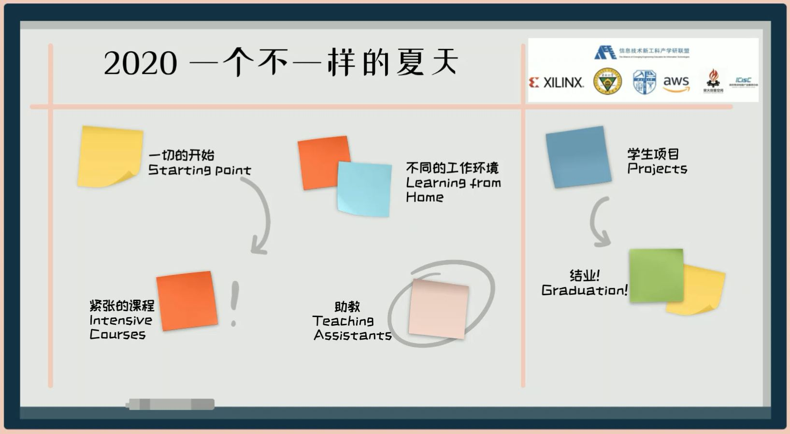
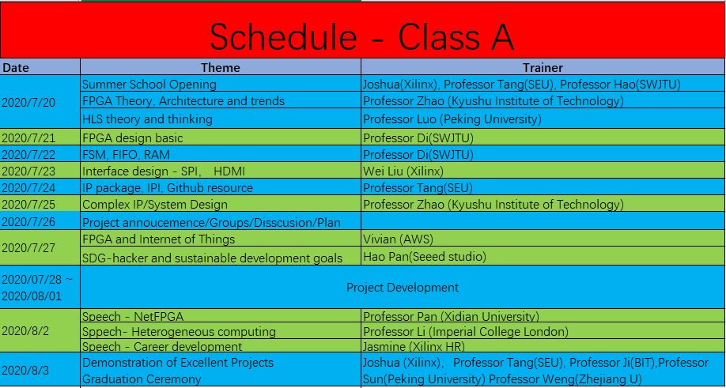
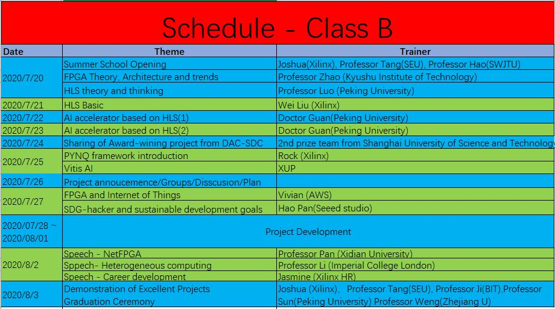

# 2020 Xilinx Summer Camp

本次由信息技术新工科联盟主办，Xilinx、东南大学，西南交大联合承办的暑期学校已于8月3日落下帷幕。从7月20日到8月3日这15天时间里，超过1200名学员在全世界各地通过互联网参与了这一次暑期学校。

本仓库用于记录本次暑期学校培训的部分项目和日程，详细的培训内容与优秀项目信息请关注下方**PYNQ开源社区**公众号获取。

往期回顾：
[2019年Xilinx暑期学校](https://github.com/xupsh/2019_SummerCamp)

# Summer Camp Schedule（日程回顾）

## Projects List（项目列表）

The details of the projects are shown as follow.

部分优秀项目的详细信息如下所示，更多项目信息将会逐渐补充：

No. | Platform | Team Member | Project Name 
-|-|-|-
B-1| PYNQ-Z2 | 唐维伟、张智欣、刘毅波、陈赏恩 |[基于FPGA加速的手写数字识别网络部署](https://github.com/Psyduckcoco/lenet-5)
B-2| PYNQ-Z2 | 范浩	张佳乐、刘可仁         | [MD5算法的FPGA实](https://github.com/Gatsby253/HLS-MD5.git) 
 B-3 | PYNQ-Z2 | 吴健 | [基于PYNQ的深度卷积网络加速设计](https://github.com/Memory-bread/SSD_IN_PYNQ) 
 B-4 | PYNQ-Z2 | 张泽坤、王纪尧、莘乃杰、管斌 | [基于PYNQ-Z2的失焦图像去模糊系统](https://github.com/PaiPai121/Defocus-Image-Deblurring-Based-on-PYNQ) 
 B-5 | PYNQ-Z2 | 范峻凌、孔欣杰、翟林帆 | [基于PYNQ-Z2的交通标志识别](https://github.com/vanDeagle/Traffic-sign-recongnition-on-PYNQ-Z2) 
 B-6 | PYNQ-Z2 | 庞健、袁健熊、刘思军、雷茂 | [基于HLS实现LSM的并行化结构算法](https://github.com/pangjianbaba/PangJian.git) 
 B-7 | PYNQ-Z2 | 张雨、李国庆、王九阳、杨浩 | [目标检测](https://github.com/ZhangYuQAQ/Hardware-Acceleration-Circuit-Design-of-Object-Detection-Network-Based-on-FPGA) 
 B-8 | Ultra96_V2 | 张经纬、林志坚、李娇杰 | [基于Vitis AI的口罩佩戴识别系统](https://github.com/seujingwei/Masking-Detection) 
 B-9 | Ultra96_V2 | 章寅、凌瑾、丁圣杰 | [Flower5-花朵识别装置](https://github.com/MIracleyin/Flower5_u96) 
 B-10 | PYNQ-Z2 | 余全洲、余全洲、张文愚、王林丰 | [双目视觉测距](https://github.com/marshmallow911/Binocular-Stereo-Vision-PYNQ.git) 
 B-11 | Ultra96_V2 | 赵懿晨、石金泉、薛俊韬、商磊 | [基于Ultra 96的智能门锁](https://github.com/XilinxCannonFodderTeam) 
 B-12 | Ultra96_V2 | 李洋、张怀智 、范歆琦、乔康乾 | [基于Ultra96平台的行人检测系统](https://github.com/Liyang0520/Face-Emotion-Recognition-On-FPGA) 
 B-13 | PYNQ-Z2 | 邓佺、王赟、晁志腾 | [手写体数学公式计算器](https://github.com/Microdent/Handwritten_Mathematical_Calculator_on_FPGA.git) 
 B-14 | PYNQ-Z2 | 李佩琦、冯一飞 | [基于pynq的压缩算法加速实现](https://github.com/fyflxl/High-level-synthesis-flow-on-zynq-using-vivado-hls-master) 
B-......| ...... | ...... |......
 A-1 | SEA-S7 | 蒋明月、王栋 |[形状识别](https://github.com/jiangmy99/Shape-Recognition-on-SEA.git)
 A-2 | SEA-S7 | 卞思格、刘玉洁 |[贪吃蛇游戏](https://github.com/xexewhy/sea-Greedy-Snake)
 A-3 | SEA-S7 | 黄辰宇、魏天宇 |[颜色识别+彩灯](https://github.com/harveyhuang18/Colorful-Lights-Based-on-SEA-Board-and-Camera-using-Vivado-HLS-master)
 A-4 | SEA-S7 | 雷弈、倪雨晴 |[猫里奥](https://github.com/06a17301/sea_catmario#sea_catmario)
 A-5 | SEA-S7 | 邓兆荣、朱智涵 | [电机测速](https://github.com/MMMMMARIO11/PWM-motor-control-and-UART-Communication-velocity-measurement.git) 
 A-6 | SEA-S7 | 洪嘉祥、林云韬 | [躲避车游戏](https://github.com/JackHong813/game1.git) 
 A-7 | SEA-S7 | 杜娟、李可欣 | [AES加密算法](https://github.com/KexinLi-design/Xlinx-SummerSchool-AWS_IoT-AES_Algorithm.git) 
 A-8 | SEA-S7 | 吴陈雨、吴婕 | [数字识别](https://github.com/xuanhui0815/digital-recognition.git) 
 A-9 |SEA-S7 | 王天淏、丁桢炎 | [MD5加密校验](https://github.com/fuqin-feilong/MD5_CRC) 
 A-10 |SEA-S7 | 吴雪、王柏旭| [仪表仪器-虚拟示波器](https://github.com/www-ha/2020-New-Engineering-Alliance-Xilinx-Summer-School-project) 
 A-11 | SEA-S7 |陈烽菱、王承祥 | [经典游戏复现_flappy bird](https://github.com/Cococopyer/FPGA_game) 
 A-12 | SEA-S7|  张宇航	张淼森、赵国庆 | [石头、剪刀、布](https://github.com/For-up/SEA-S7Guess)
 A-13 | SEA-S7| 李星瑶、邹涛|[电机控制](https://github.com/lixingyao-zoutao/lxy-zt.git)
 A-14 | EGO-1 |张嘉庆、吴洪洋、陈治兆 | [滤波器算法与任意波形发生器](https://github.com/wuhongyang84/Arbitrary_waveform_generator.git)
 A-15 |ZYBO+ESP8266 | 于大江、张青毅 |[滤波器算法与任意波形发生器](https://github.com/djgq2020/Arbitrary_waveform_generator)
 A-16 | SEA-S7| 李政轩 |[实现多路UART/SPI](https://github.com/Baksimuke/Xilinx-Summer-School.git)
 A-......| ...... | ...... |......

# Contribute（贡献）

Please continue to optimize the designs and update your github.

虽然暑期学校已经结束，我们依然欢迎大家继续改进设计，并提交修订版的代码和文档到github中。